# Experiment Models
### Exp 1

```julia
using Pumas, MCMCChains, StatsPlots, GibbsSampler, Distributions

theopmodel_bayes = @model begin
  @param begin

    # Mode at diagm(fill(0.2, 3))
    Ω1 ~ Uniform(0.1,0.6)
    Ω2 ~ Uniform(0.1,0.6)
    Ω3 ~ Uniform(0.1,0.6)

    # Mean at 0.5 and positive density at 0.0
    σ ~ Gamma(1.0, 0.5)
  end

  @random begin
    η1 ~ Normal(Ω1)
    η2 ~ Normal(Ω2)
    η3 ~ Normal(Ω3)
  end

  @pre begin               
    Ka = (SEX == 1 ? 0.3 : 0.4)*exp(η1)
    CL = 0.2*(WT/70)            *exp(η2)
    Vc = 0.5                    *exp(η3)
  end

  @covariates SEX WT

  @dynamics Depots1Central1

  @derived begin
    # The conditional mean
    μ := @. Central / Vc
    # Additive error model
    dv ~ @. Normal(μ, σ)
  end
end

data = read_pumas(example_data("event_data/THEOPP"), covariates = [:SEX,:WT])

param = init_param(theopmodel_bayes)
result = fit(theopmodel_bayes, data, param, Pumas.BayesGibbs(MH(n_samples = 35));nsamples=1000)
```

#### Gibbs with MH, n_samples = 35
```

Time elapsed: 1:08
parameters      mean       std   naive_se      mcse        ess      rhat

Ω1[1]    0.3547    0.1443     0.0036    0.0062   562.0578    1.0043
Ω2[1]    0.3598    0.1411     0.0035    0.0052   638.6811    0.9994
Ω3[1]    0.3597    0.1416     0.0035    0.0050   582.7379    0.9994
σ[1]    0.8263    0.0778     0.0019    0.0147     5.5371    1.5077

```

#### BayesMCMC
```julia
result = fit(theopmodel_bayes, data, param, Pumas.BayesMCMC();nsamples=2000, nadapts = 1000)
chains = Pumas.Chains(result)
```
```
Time elapsed: 00:41
parameters      mean       std   naive_se      mcse        ess      rhat

    Ω1    0.5130    0.0805     0.0025    0.0045   367.3842    1.0061
    Ω2    0.1493    0.0486     0.0015    0.0025   374.7807    0.9998
    Ω3    0.2336    0.1098     0.0035    0.0064   152.7344    1.0051
     σ    0.7224    0.1433     0.0045    0.0091   222.0662    1.0021
```


Trace Plot

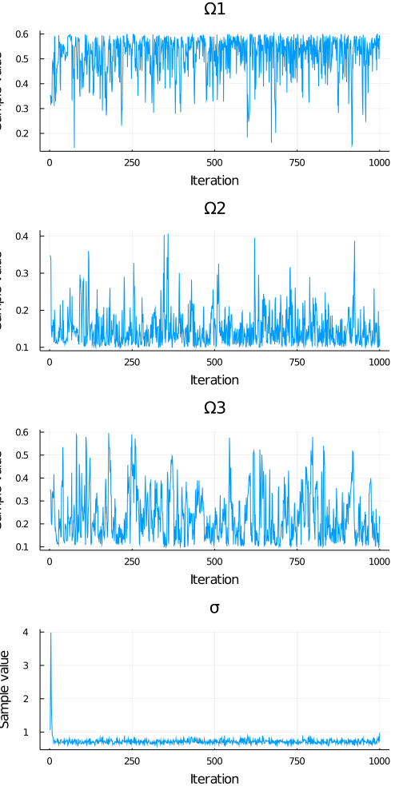
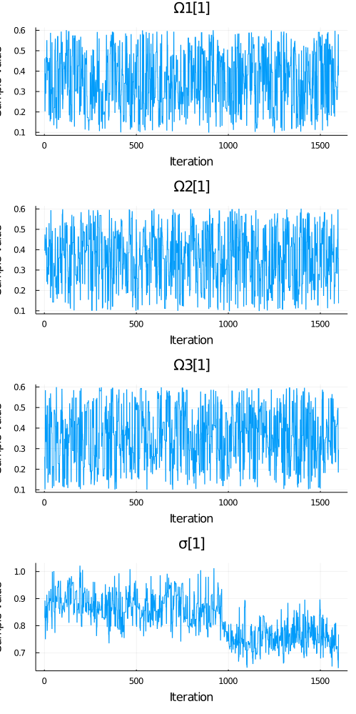

Histogram Plot

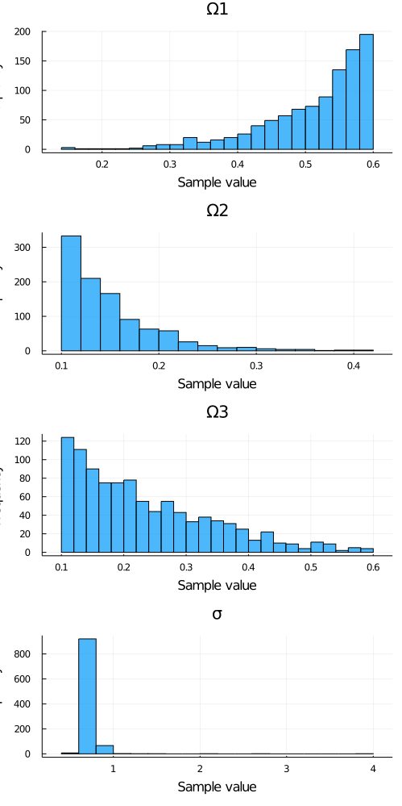
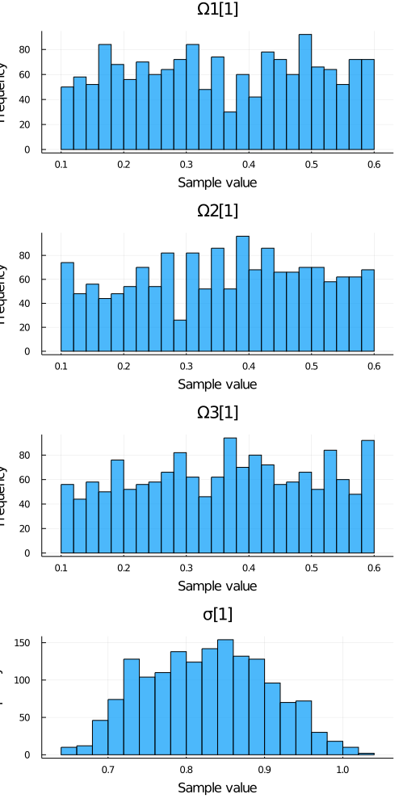

Autocorrelation Plot

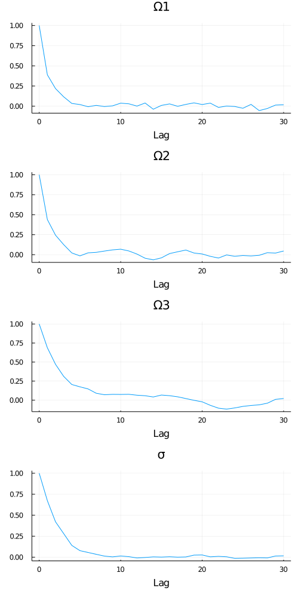
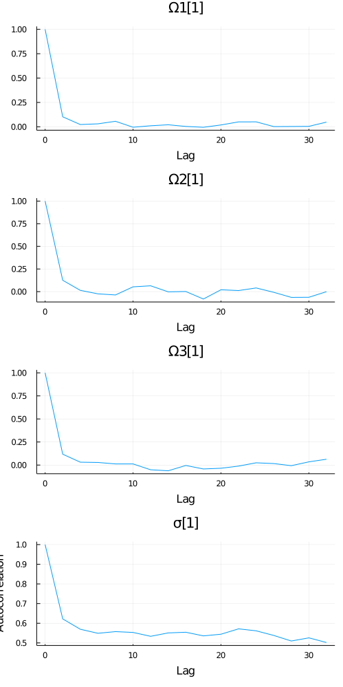


## Second Model: Only one fixed effect and one Random effect

```julia
using Pumas, MCMCChains, StatsPlots, GibbsSampler, Distributions

theopmodel_bayes = @model begin
  @param begin
    Ω3 ~ Uniform(0.1,0.6)
  end

  @random begin
    η3 ~ Normal(Ω3)
  end

  @pre begin
    Ka = (SEX == 1 ? 1.8459 : 1.8014)*exp(0.5890)
    CL = 0.0419*(WT/70)            *exp(0.0507)
    Vc = 0.4747                    *exp(η3)
  end

  @covariates SEX WT

  @dynamics Depots1Central1

  @derived begin
    # The conditional mean
    μ := @. Central / Vc
    # Additive error model
    dv ~ @. Normal(μ, 0.7045)
  end
end

data = read_pumas(example_data("event_data/THEOPP"), covariates = [:SEX,:WT])

param = init_param(theopmodel_bayes)
result = fit(theopmodel_bayes, data, param, Pumas.BayesGibbs(MH());nsamples=1000)
```

### Results

Bayes MCMC
```
Summary Statistics
  parameters      mean       std   naive_se      mcse       ess      rhat
      Symbol   Float64   Float64    Float64   Float64   Float64   Float64

          Ω3    0.3357    0.1437     0.0045    0.0295   22.2565    1.0022

```

Gibbs

```
Summary Statistics
  parameters      mean       std   naive_se      mcse       ess      rhat
      Symbol   Float64   Float64    Float64   Float64   Float64   Float64
      
 Ω3[1]    0.3416    0.1450     0.0036    0.0043   807.5492    0.9997
η3_1[1]   -0.1847    0.0427     0.0011    0.0030   199.4304    1.0015
η3_2[1]    0.0461    0.0507     0.0013    0.0033   286.1674    0.9994
η3_3[1]    0.0598    0.0443     0.0011    0.0028   220.5266    1.0020
η3_4[1]    0.1435    0.0488     0.0012    0.0033   220.3823    0.9996
η3_5[1]    0.2658    0.0374     0.0009    0.0022   285.0528    1.0012
η3_6[1]    0.3435    0.0668     0.0017    0.0032   332.1274    0.9996
η3_7[1]    0.5415    0.0565     0.0014    0.0035   290.7535    0.9994
η3_8[1]    0.2877    0.0507     0.0013    0.0029   288.6590    0.9994
η3_9[1]   -0.3879    0.0508     0.0013    0.0033   252.6710    1.0018
η3_10[1]    0.3109    0.0411     0.0010    0.0029   201.6407    1.0029
η3_11[1]    0.2538    0.0500     0.0012    0.0039   166.5176    1.0281
η3_12[1]    0.2324    0.0434     0.0011    0.0025   239.5191    1.0006
```


Trace Plot

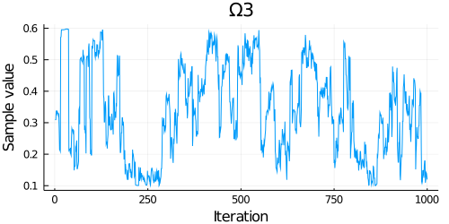
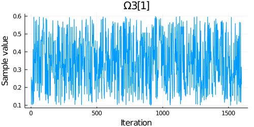

Histogram Plot

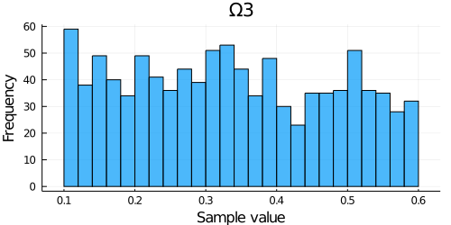
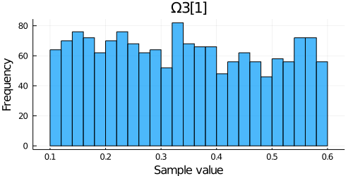

Autocorrelation Plot

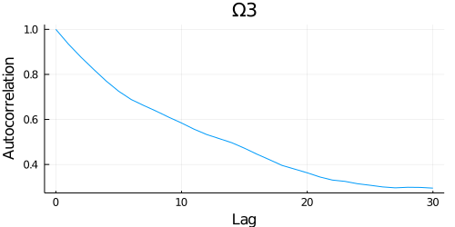
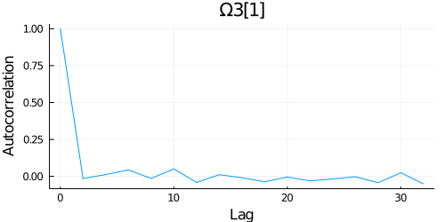

Log Probability
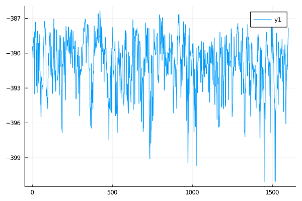
